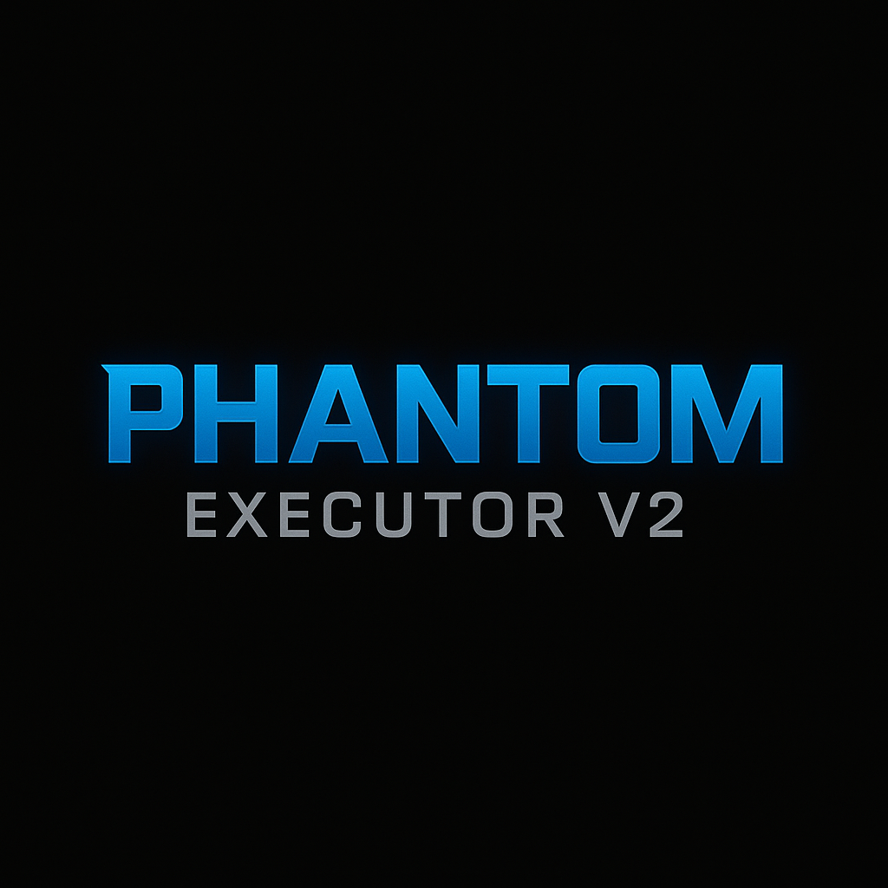

  

# Phantom Executor v2

**Phantom Executor v2** is a refined, high-performance Roblox script executor engineered for speed, stealth, and flexibility.  
Rebuilt from the ground up, it delivers a clean execution pipeline with zero clutter, fast injection times, and seamless multithreaded support — all while maintaining an extremely low detection profile.

---

## Overview

Phantom v2 is designed for developers and advanced users who demand performance without compromise.  
With a focus on reliability and stability, it offers powerful execution capabilities while remaining lightweight and easy to integrate.

### Key Features

- **Stealth Execution**  
  Bypasses most modern detection vectors using advanced sandbox evasion and obfuscation methods.

- **Multithreaded Architecture**  
  Supports simultaneous script execution with minimal performance impact or interference.

- **Rapid Injection**  
  Instantly attaches to the Roblox client and executes scripts with near-zero delay.

- **Modular & Clean**  
  Built with maintainability in mind — no unnecessary features, just raw performance and customization potential.

- **Crash Resistance**  
  Includes internal error handling and auto-recovery systems for more resilient runtime behavior.

---

## Purpose

Phantom Executor v2 is meant for testing, automation, and educational use within controlled environments.  
Whether you're debugging Lua environments or developing tools, Phantom provides a stable and responsive execution layer.

> Minimalistic by design. Powerful by nature.  
> Phantom v2 redefines what a Roblox executor can be.
